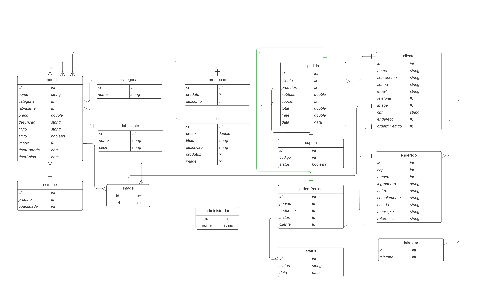

# BRIGHTME

## Descrição

## Motivações

# Front-End 🖼️

Front-end será desenvolvido em html, css, javascrip e ejs.
Foi inspirados em cores mais sóbrios para trazer harmonia e a paz que os produtos visam oferecer. Focado em atender diversos dispositivos, do desktop ao mobile.

O Figma foi utilizado para prototipar o projeto.

Foi escolhido utilizar o ejs para renderizar as views.

Link protótipo: https://www.figma.com/file/Q0SAknsw6ue4HVEsKK9Yu1/Home?node-id=0%3A1

## Tools

Foi criado padrão de projetos para facilitar o desenvolvimento em grupo. No pacote de desenvolvimento foi definido o arquivo **main.css** como core do css.

#### Paletas de cores

As paletas de cores iniciais são:

- --main-white: #fff;

- --main-yellow: #f1c40f

- --main-grey: #d4d4d4;

- --main-grey-700: #979797;

- --main-rosa: #e15f41;

- --main-blue: #303952;

- --main-green: #27ae60;

- --main-red: #d63031;

#### Font family

A Fonte escolhida foi a POPPINS, por ser uma fonte extremamente versatil e agrádavel.

#### Shortcuts Class

- card
- container
- bg-"color"
- t-"color"
- d-flex
- all-center
- w-100
- h-100
- btn
- btn-"type"
- list
- link
- mt-20 : margin-top: 20px
- mt-40 : margin-top: 40px
- item-list
- w-100 : width: 100%
- h-100 : heigth: 100%

# Back-End 🛠️

## Será desenvolvido com Node.js e todos os poderes do Javascript e o npm como gerenciador de pacote.

## Rotas

#### Home

'/'

#### Sucesso de compra

'/sucess'

#### Pagina de listagem de produtos e filtro

'/produtos'
### Pagina de produto
'/produto'

### Conta do usuário
'/conta'

### Pagamento
'/pagamento'

### Login
'/login'

### BLog

'/blog'

### Carrinho
'/carrinho'
# Banco de Dados 🎲
## Mysql será utilizado como banco de dado
Abaixo esta a modelagem inicial do banco de dados.    

## Schemas

### A principio são 14 modelos

1.  [x] cliente
2.  [x] telefone
3.  [x] endereco
4.  [x] categoria
5.  [x] fabricante
6.  [x] image
7.  [x] adm
8.  [x] estoque
9.  [x] produto
10. [x] promocao
11. [x] kit
12. [x] pedido
13. [x] status
13. [x] ordemPedido
14. [x] cupom

### Para fácil visualização do banco o _localhost:8080_ pode ser acessado.
